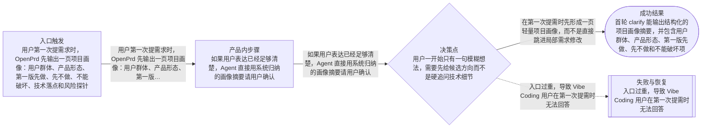

# 流程

## 主流程

- 用户第一次提需求时，OpenPrd 先输出一页项目画像：用户群体、产品形态、第一版先做、先不做、不能破坏、技术落点和风险探针
- 如果用户表达已经足够清楚，Agent 直接用系统归纳的画像摘要请用户确认
- 如果用户表达模糊，Agent 先追问少量高价值问题，必要时给 2 到 3 个方向或行业原型供用户选择
- 画像确认后再进入后续 PRD、review、change 和 tasks 流程

## Mermaid 流程图

## 边界情况

- 用户一开始只有一句模糊想法，需要先给候选方向而不是硬追问技术细节
- 已有项目上下文时应优先沿用已知事实，而不是把所有画像问题重问一遍
- 局部 copy、样式或小交互修正不应被错误升级成重画像流程

## 失败模式

- 入口过重，导致 Vibe Coding 用户在第一次提需时无法回答
- 入口过轻，导致 Agent 没有先确认项目边界就直接落地
- 错误复用旧 active change 或旧 PRD 上下文，导致实现偏题
