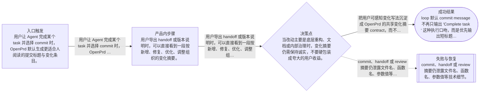
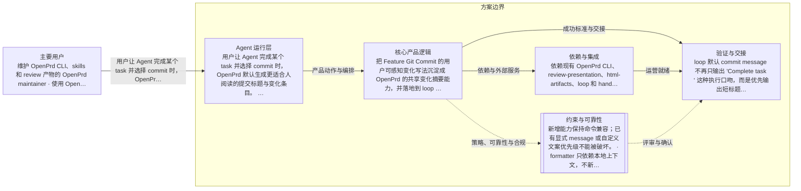

# OpenPrd 用户视角变化摘要
> 语言规则：默认用简体中文生成 PRD、spec、tasks 和用户可见说明；除 PRD、OpenPrd、OpenSpec、API、SDK、CLI、TypeScript、JSON、HTTP、WebSocket、字段 key、命令名、品牌名、产品名和协议名等必要专有名词外，其余内容优先写成简体中文。
- 版本: v0002
- 负责人: Codex
- 产品类型: agent
- 模板包: agent
- 状态: synthesized
- 生成时间: 2026-06-02 11:39:56
## 元信息

- 标题: OpenPrd 用户视角变化摘要
- 负责人: Codex
- 状态: classified
- 版本: v0002
- 产品类型: agent
- 日期: 2026-06-02

## 问题

- 问题陈述: 把 Feature Git Commit 的用户可感知变化写法沉淀成 OpenPrd 的共享变化摘要能力，并落地到 loop commit、handoff / 版本说明、review 摘要三处。
- 为什么是现在: 用户已经确认方向，希望 OpenPrd 默认就能写出更适合人阅读的变化说明，而不是把这类经验留在单独 skill 里。
- 证据:
  - 待补充

## 用户与相关方

- 主要用户:
  - 维护 OpenPrd CLI、skills 和 review 产物的 OpenPrd maintainer
  - 使用 OpenPrd 执行任务并需要生成 commit、handoff 或版本说明的 Agent 使用者
- 次要用户:
  - 待补充
- 相关方:
  - 阅读交付变更、提交说明和版本说明的项目负责人
  - 需要快速判断这次改动是否值得合入或发布的协作者

## 目标与成功标准

- 目标:
  - 把用户可感知变化写法沉淀成 OpenPrd 的共享变化摘要 contract，而不是停留在单个 commit skill。
  - 让 OpenPrd 在 loop commit、handoff / 版本说明、review 摘要三处都能输出更适合人阅读的变化说明。
  - 保持 OpenPrd 现有 workflow、review gate 和高风险提交门禁不变，只升级表达层。
- 成功指标:
  - loop 默认 commit message 不再只输出 `Complete <task>` 这种执行口吻，而是优先输出短标题加动作词条目。
  - handoff 导出结果包含可直接复用的变化摘要或版本说明片段，便于人快速扫读。
  - review 摘要文案的标签和一句话说明更明显地站在用户视角表达新增、修复、优化、调整等变化。
  - 完成后用单独 worker 跑一个样例项目，能看到这套变化摘要在真实任务中的输出效果。
- 验收目标:
  - 新增一套共享变化摘要规则，明确标题、动作词、用户视角和避免技术细节的写法。
  - loop commit、handoff / 版本说明、review 摘要三处都接入这套规则，并保留必要的回退逻辑。
  - README、skills 或相关生成指引同步说明这套默认写法。
  - 本地测试覆盖 formatter、调用方接线和回退路径。

## 范围与非目标

- 范围内:
  - 新增共享变化摘要 formatter 或 contract。
  - 修改 loop task commit 默认文案生成。
  - 修改 handoff 导出内容，加入面向人的变化摘要 / 版本说明区块。
  - 修改 review presentation 或相关摘要 contract，让标签和一句话说明更贴近新增、修复、优化、调整等用户视角表达。
  - 补充 README、skills、文档和测试。
  - 完成后用 worker 在单独项目上跑一次最小验证。
- 范围外:
  - 不把 Feature Git Commit 的自动 tag、自动 push、版本号阻断、敏感扫描整包并入 OpenPrd 默认工作流。
  - 不改写历史 commit 或历史 handoff 产物。
  - 不要求所有技术性内部说明都必须被改写成用户文案；只约束面向人的变化摘要层。

## 场景与流程

- 主流程:
  - 用户让 Agent 完成某个 task 并选择 commit 时，OpenPrd 默认生成更适合人阅读的提交标题与变化条目。
  - 用户导出 handoff 或版本说明时，可以直接看到一段按新增、修复、优化、调整组织的变化摘要。
  - 用户查看 review 评审摘要时，能先用短标签和一句话理解这次带来的用户可感知变化，而不是先读技术实现。
- 边界情况:
  - 当改动主要是底层重构、文档或内部治理时，变化摘要仍需保持诚实，不要硬包装成夸大的用户收益。
  - 一个任务可能同时包含新增和修复，摘要需要支持多个动作词条目归到同一个短标题下。
  - 如果当前上下文不足以生成可信的用户视角摘要，调用方需要保留清晰回退，而不是输出胡乱包装的文案。
- 失败模式:
  - commit、handoff 或 review 摘要仍泄露文件名、函数名、参数值等技术细节。
  - 摘要为了好看而扭曲真实改动，把内部治理误写成用户可感知功能。
  - 三处落点风格不一致，用户在 commit、handoff 和 review 里看到三套不同写法。

## 可视化图表

### 产品流程

### 架构

## 需求

- 功能需求:
  - OpenPrd 提供共享变化摘要规则，支持短标题、动作词条目和用户视角描述。
  - loop 在未显式传入 message 时，优先基于 task 上下文生成用户视角 commit message。
  - handoff 导出内容增加变化摘要 / 版本说明字段，并写入 markdown 与 json 产物。
  - review 摘要 contract 明确要求标签和一句话说明优先表达新增、修复、优化、调整等变化结论。
  - 相关 skills、README 或生成引导同步提示这套默认写法。
- 非功能需求:
  - 新增能力保持命令兼容；已有显式 message 或自定义文案优先级不能被破坏。
  - formatter 只依赖本地上下文，不新增外部网络、第三方 API 或额外付费依赖。
  - 输出在中英文混合项目里仍以当前用户语言为主，必要专有名词保持原样。
- 业务规则:
  - 变化摘要优先描述用户能看到或感受到的变化，不优先描述代码实现细节。
  - 默认动作词优先使用新增、修复、优化、调整、移除；只有确有必要时才扩展。
  - 除非用户明确要求技术细节，否则 commit、handoff 和 review 摘要中避免出现文件名、函数名、参数值或内部模块术语。

## 业务护栏

- 成本来源:
  - 无新增第三方付费调用成本；变化摘要完全基于本地上下文生成。
- 额度与限制:
  - 不引入新的用户额度或发布配额限制；沿用现有 commit / handoff 执行门禁。
- 滥用防护:
  - 不把自动 push、自动 tag 或历史重写并入默认能力，避免摘要能力演变成高风险自动发布路径。
- 监控信号:
  - 关注生成摘要是否频繁退回技术细节、是否在测试中出现失真或空摘要。
- 报警阈值:
  - 如果三处输出中任一处无法生成可信摘要并持续回退，需要在测试中显式暴露。
- 止损动作:
  - 当上下文不足或摘要质量不可信时，回退到现有安全文案，不自动包装。

## 约束、依赖与风险

- 技术约束:
  - 需要兼容现有 loop、handoff、review-presentation 和 html-artifacts 的调用契约。
  - 需要在 dirty workspace 中做窄改动，避免误伤正在进行的 test-strategy-router 等历史工作。
- 合规要求:
  - 待补充
- 依赖:
  - 依赖现有 OpenPrd CLI、review-presentation、html-artifacts、loop 和 handoff 导出流程。
- 假设:
  - 用户更看重人能快速扫懂的变化摘要，而不是技术完整性优先的底层说明。
  - 三处落点可以共用一套核心 formatter，再按场景做轻量渲染差异。
- 风险:
  - 如果 formatter 规则过死，可能把一些纯技术任务描述得失真。
  - 如果只改一处而没有共用 contract，后续很快会再次分叉。
- 开放问题:
  - 是否需要把默认动作词进一步 grow-aware，让项目级偏好后续可配置。

## 类型专项模块

- 类型: Agent 专项
- humanAgentContract: Agent 可以根据 task、handoff 和 review 上下文生成变化摘要草案，但不能把自动生成的摘要当成发布事实之外的营销文案；高风险提交行为仍遵守现有执行门禁。
- autonomyBoundary: Agent 可以修改 OpenPrd 的 formatter、skills、文档、测试和 worker 验证流程；不得自动推送、改写历史提交，或把 Feature Git Commit 的高风险 git 行为直接并入 OpenPrd 默认流。
- toolBoundary: 仅使用本地 OpenPrd 代码、CLI、测试与 worker 会话完成实现和验证；本次不需要额外第三方文档调研。
- stateModel: 共享变化摘要 contract 负责统一标题、动作词和描述规则；loop、handoff、review 三个调用面只做各自场景渲染与回退控制。
- evalPlan: 先做本地单测和回归，再用 worker 在单独样例项目上跑一个最小任务，检查 commit、handoff 或 review 摘要输出是否符合预期。

## 交接

- 负责人: Codex
- 下一步: 确认新的评审稿后生成 change 和 tasks，并按三处落点实现。
- 目标系统: OpenSpec
