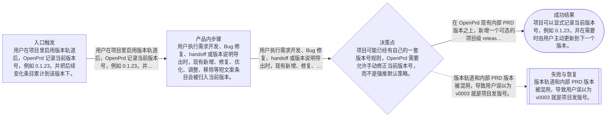
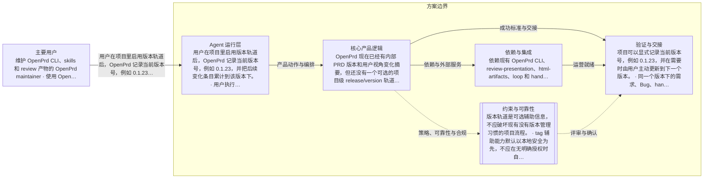

# OpenPrd 项目级版本轨道与变化摘要
> 语言规则：默认用简体中文生成 PRD、spec、tasks 和用户可见说明；除 PRD、OpenPrd、OpenSpec、API、SDK、CLI、TypeScript、JSON、HTTP、WebSocket、字段 key、命令名、品牌名、产品名和协议名等必要专有名词外，其余内容优先写成简体中文。
- 版本: v0004
- 负责人: Codex
- 产品类型: agent
- 模板包: agent
- 状态: synthesized
- 生成时间: 2026-06-02 12:24:42
## 元信息

- 标题: OpenPrd 项目级版本轨道与变化摘要
- 负责人: Codex
- 状态: clarifying
- 版本: v0004
- 产品类型: agent
- 日期: 2026-06-02

## 问题

- 问题陈述: OpenPrd 现在已经有内部 PRD 版本和用户视角变化摘要，但还没有一个可选的项目级 release/version 轨道来维护当前版本号、版本内更新项，以及与 commit tag 的协同规则。结果是版本号已经在项目里被真实使用，却缺少一个本地真源来累计本版本的需求、Bug、handoff 摘要和最终发布说明。
- 为什么是现在: 用户已经确认，希望在现有短文案变化摘要的基础上，再补一个可选的项目级版本轨道：既能维护当前版本和版本内更新内容，也能在 commit 流里利用版本信息辅助打 tag，让 release notes、handoff 和外部同步有稳定来源。
- 证据:
  - 待补充

## 用户与相关方

- 主要用户:
  - 维护 OpenPrd CLI、skills 和 review 产物的 OpenPrd maintainer
  - 使用 OpenPrd 执行任务并需要生成 commit、handoff 或版本说明的 Agent 使用者
- 次要用户:
  - 待补充
- 相关方:
  - 阅读交付变更、提交说明和版本说明的项目负责人
  - 需要快速判断这次改动是否值得合入或发布的协作者

## 目标与成功标准

- 目标:
  - 在 OpenPrd 现有内部 PRD 版本之上，新增一个可选的项目级 release/version 轨道，用来维护当前版本号与版本内更新项。
  - 把现有用户视角短文案摘要和项目版本轨道结合起来，让 commit、handoff、release notes 与外部同步都能复用同一套版本内变化条目。
  - 在用户显式使用 commit 流且版本信息可用时，提供与版本号协同的 tag 辅助能力，但保留高风险 git 行为的安全护栏。
- 成功指标:
  - 项目可以显式记录当前版本号，例如 0.1.23，并在需要时由用户主动更新到下一个版本。
  - 同一个版本下的需求、Bug、handoff 摘要和 release notes 候选可以被累计到本地版本条目池，而不是散落在 commit 或外部表格中。
  - 当用户通过 OpenPrd 执行 commit 且当前版本已启用时，系统可以为该版本创建或更新本地 tag 指向最新 commit，帮助快速界定本版本自上一个版本以来的提交范围。
  - 当目标版本 tag 已经在远端存在时，系统不会默认 force 覆盖，而是明确提示当前指向和下一步选择。
- 验收目标:
  - 新增项目级 release/version ledger，支持 current version、版本状态和版本内变化项存储。
  - 现有变化摘要层继续复用新增、修复、优化、调整、移除等短文案动作词，并能挂到具体项目版本下。
  - commit 流在启用版本轨道且用户明确执行时，可以读取当前版本并辅助创建或更新本地版本 tag；同版本多次提交时 tag 可移动到最新 commit。
  - README、skills、handoff/release 导出和测试同步说明版本轨道与 tag 协同规则。

## 范围与非目标

- 范围内:
  - 新增可选的项目级 release/version ledger，用于维护当前版本号、版本状态和版本内更新项。
  - 把现有变化摘要条目挂载到具体项目版本下，支持需求、Bug、handoff 摘要和 release notes 候选的累计。
  - 扩展 commit 流，在版本轨道已启用且用户显式执行 commit 时读取当前版本，并辅助创建或更新本地版本 tag。
  - 扩展 handoff、release notes 与后续外部同步出口，让它们可以从项目版本轨道导出版本内变化内容。
  - 补充 README、skills、文档和测试，并验证项目版本轨道与短文案摘要的协同效果。
- 范围外:
  - 不把内部 PRD 版本 v000x 直接改造成项目发版号。
  - 不强制所有项目都启用版本轨道；没有版本管理习惯的项目可以继续只用现有变化摘要能力。
  - 不默认自动 push、自动发布或自动 force 更新远端 tag。
  - 不要求替代团队已有的外部版本体系，只提供一个本地可维护、可导出的辅助真源。

## 场景与流程

- 主流程:
  - 用户在项目里启用版本轨道后，OpenPrd 记录当前版本号，例如 0.1.23，并把后续变化条目累计到该版本下。
  - 用户执行需求开发、Bug 修复、handoff 或版本说明导出时，现有新增、修复、优化、调整、移除等短文案条目会被归入当前版本。
  - 用户通过 OpenPrd 执行 commit 且当前版本可用时，系统使用该版本号辅助创建或更新本地 tag，让同版本多次提交始终能由最新 commit 挂着该版本标签。
  - 用户需要对外同步 Feishu 或生成版本说明时，可以直接导出当前版本下累计的主要更新内容。
- 边界情况:
  - 项目可能已经有自己的一套版本号规则，OpenPrd 需要允许手动修正当前版本号，而不是强推默认策略。
  - 如果同一个版本下发生多次 commit，本地 tag 可以移动到最新 commit；但如果对应 tag 已经推到远端，继续移动会变成高风险操作。
  - 有些项目只想维护版本说明，不想碰 git tag；版本轨道与 tag 辅助能力需要可分开启用。
  - 如果用户在没有更新版本号的情况下继续提交，系统应把新变化继续累计到当前版本，而不是猜测用户要自动 bump 版本。
- 失败模式:
  - 版本轨道和内部 PRD 版本被混用，导致用户误以为 v0003 就是项目发版号。
  - 系统在远端已有同名 tag 的情况下仍默认移动 tag，导致历史版本指向被静默改写。
  - 变化摘要条目没有归到正确版本，导致版本说明、handoff 和外部同步内容失真。
  - tag 辅助能力和 commit 流耦合过紧，反而让只想写版本说明的项目被迫碰 git 发布动作。

## 可视化图表

### 产品流程

### 架构

## 需求

- 功能需求:
  - OpenPrd 提供可选的项目级 release/version ledger，支持记录 current version、版本状态和版本内变化项。
  - 现有共享变化摘要规则支持把新增、修复、优化、调整、移除等条目关联到具体项目版本。
  - handoff 与 release notes 导出优先从项目版本轨道读取对应版本的变化条目。
  - 当版本轨道已启用且用户通过 OpenPrd 显式执行 commit 时，commit 流可以读取当前版本号并辅助创建或更新本地版本 tag。
  - 当用户未更新版本号时，后续变化默认继续累计到当前版本；当用户显式更新版本号后，新的变化进入下一个版本。
- 非功能需求:
  - 版本轨道是可选辅助信息，不应破坏现有没有版本管理习惯的项目流程。
  - tag 辅助能力默认以本地安全为先，不应在无明确授权时自动 force 更新远端 tag。
  - 现有显式 commit message、自定义 handoff 内容和已有版本体系优先级不能被新能力静默覆盖。
  - 版本轨道与变化摘要的输出应继续以用户当前语言为主，避免把内部 git 或实现细节直接写入用户可见文案。
- 业务规则:
  - 内部 PRD 版本和项目 release 版本必须保持分层，不能共用一个字段。
  - 项目 release 版本默认允许用户手动指定或手动修正；系统只做辅助，不替用户决定版本 bump。
  - 同版本多次 commit 时，本地版本 tag 可以指向最新 commit，帮助界定本版本从上一个版本 tag 之后的提交范围。
  - 如果目标版本 tag 已经存在于远端，系统不得默认覆盖；需要明确提示当前指向并等待用户决定。
  - 版本说明继续优先使用新增、修复、优化、调整、移除等人类可读动作词，而不是直接复述 git 变更细节。

## 业务护栏

- 成本来源:
  - 无新增第三方付费调用成本；变化摘要完全基于本地上下文生成。
- 额度与限制:
  - 不引入新的用户额度或发布配额限制；沿用现有 commit / handoff 执行门禁。
- 滥用防护:
  - 不默认自动 push、自动发布或自动 force 更新远端 tag。
  - 只有在用户显式执行 commit 且版本轨道启用时，才进入版本 tag 辅助路径。
  - 远端已有同名版本 tag 时，系统只提示风险和当前指向，不静默改写历史。
- 监控信号:
  - 关注生成摘要是否频繁退回技术细节、是否在测试中出现失真或空摘要。
- 报警阈值:
  - 如果三处输出中任一处无法生成可信摘要并持续回退，需要在测试中显式暴露。
- 止损动作:
  - 当上下文不足或摘要质量不可信时，回退到现有安全文案，不自动包装。

## 约束、依赖与风险

- 技术约束:
  - 需要兼容现有 loop、handoff、review-presentation 和 html-artifacts 的调用契约。
  - 需要在 dirty workspace 中做窄改动，避免误伤正在进行的 test-strategy-router 等历史工作。
- 合规要求:
  - 待补充
- 依赖:
  - 依赖现有 OpenPrd CLI、review-presentation、html-artifacts、loop 和 handoff 导出流程。
- 假设:
  - 用户更看重人能快速扫懂的变化摘要，而不是技术完整性优先的底层说明。
  - 三处落点可以共用一套核心 formatter，再按场景做轻量渲染差异。
- 风险:
  - 如果 formatter 规则过死，可能把一些纯技术任务描述得失真。
  - 如果只改一处而没有共用 contract，后续很快会再次分叉。
- 开放问题:
  - 版本轨道是否需要支持 Unreleased 这种未定版态，还是只维护一个明确 current version。
  - 本地 tag 跟最新 commit 的策略是否只在未推远端前自动生效，还是需要更细的项目级配置。
  - Feishu 等外部同步出口首期是否只导出版本说明，不直接回写外部系统。

## 类型专项模块

- 类型: Agent 专项
- humanAgentContract: Agent 可以根据 task、handoff 和 review 上下文生成变化摘要草案，但不能把自动生成的摘要当成发布事实之外的营销文案；高风险提交行为仍遵守现有执行门禁。
- autonomyBoundary: Agent 可以修改 OpenPrd 的 formatter、skills、文档、测试和 worker 验证流程；不得自动推送、改写历史提交，或把 Feature Git Commit 的高风险 git 行为直接并入 OpenPrd 默认流。
- toolBoundary: 仅使用本地 OpenPrd 代码、CLI、测试与 worker 会话完成实现和验证；本次不需要额外第三方文档调研。
- stateModel: 共享变化摘要 contract 负责统一标题、动作词和描述规则；loop、handoff、review 三个调用面只做各自场景渲染与回退控制。
- evalPlan: 先做本地单测和回归，再用 worker 在单独样例项目上跑一个最小任务，检查 commit、handoff 或 review 摘要输出是否符合预期。

## 交接

- 负责人: Codex
- 下一步: 确认新的评审稿后生成 change 和 tasks，并按三处落点实现。
- 目标系统: OpenSpec
